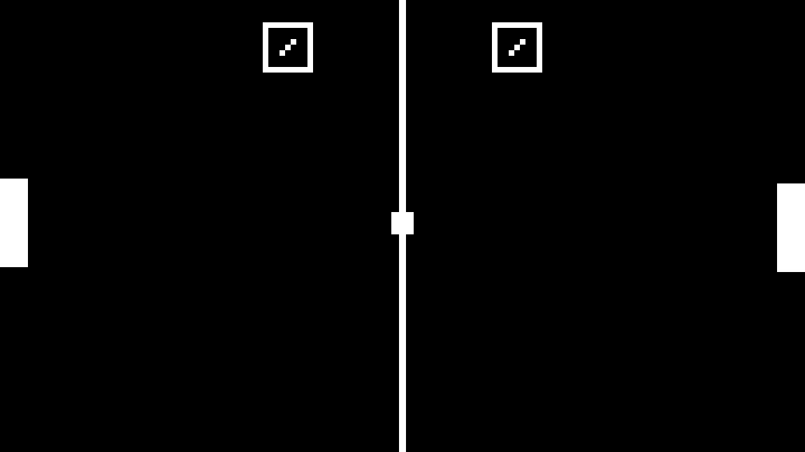

# Godot pong
[](https://github.com/Aleksuo/GodotPong/actions)
[](https://opensource.org/licenses/MIT)
[]() 

> A simple Pong clone built with Godot Engine and C#.



## Controls
- Move paddle up: *W*
- Move paddle down: *S*

## Features
- Menu splash screen with controls
- Simple ball physics
- Score tracking with game over condition on first to three scored
- Simple AI to play against
- Automated Windows release using Docker and GitHub Actions.

## Download
See the [Releases page](https://github.com/Aleksuo/GodotPong/releases) for downloads.

## Prerequisites
- Install [Godot Engine 4.1.1](https://godotengine.org/)
- Install [.NET SDK 8.0+](https://dotnet.microsoft.com/en-us/download)
- (Optional) Install the [Godot export templates](https://docs.godotengine.org/en/latest/tutorials/export/exporting_projects.html#export-templates) to export the project
- (Optional) Install Docker to run the dockerized exports

## Running the project

Once you have installed the Godot Engine, start the Project Manager and Import the project. Then you should be good to go.

### Docker exports

The root `Dockerfile` can be used to build an image of the Godot Engine with all of the export templates. This allows exporting the game without installing anything but Docker on your computer. 

The root also contains a helper script `export_project.sh`. By default running the script in the root of the project will build the Docker image, mount the directory to the container and run exports for Windows and Linux targets:
```bash
bash export_project.sh
```
If the build is successful you should see the created build artifacts in the `.build` folder.

You can also specify a specific build target for the script, for example:
```
bash export_project.sh windows
```

## Made with
[](https://godotengine.org/)
[](https://dotnet.microsoft.com/en-us/languages/csharp)
[](https://www.docker.com/)

## License

This project is licensed under the terms of MIT License (MIT). See the [LICENSE](./LICENSE) file for details.
